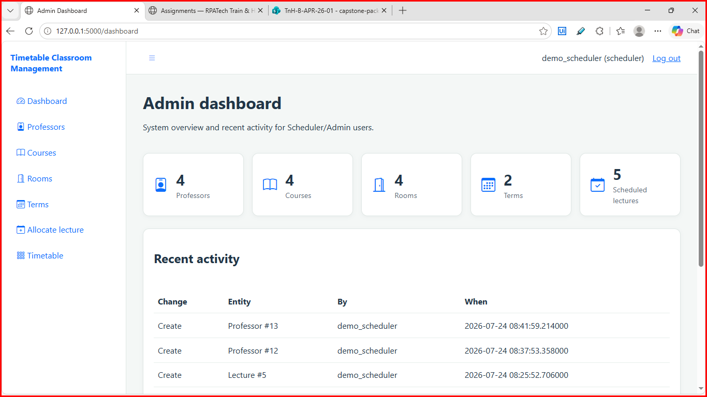
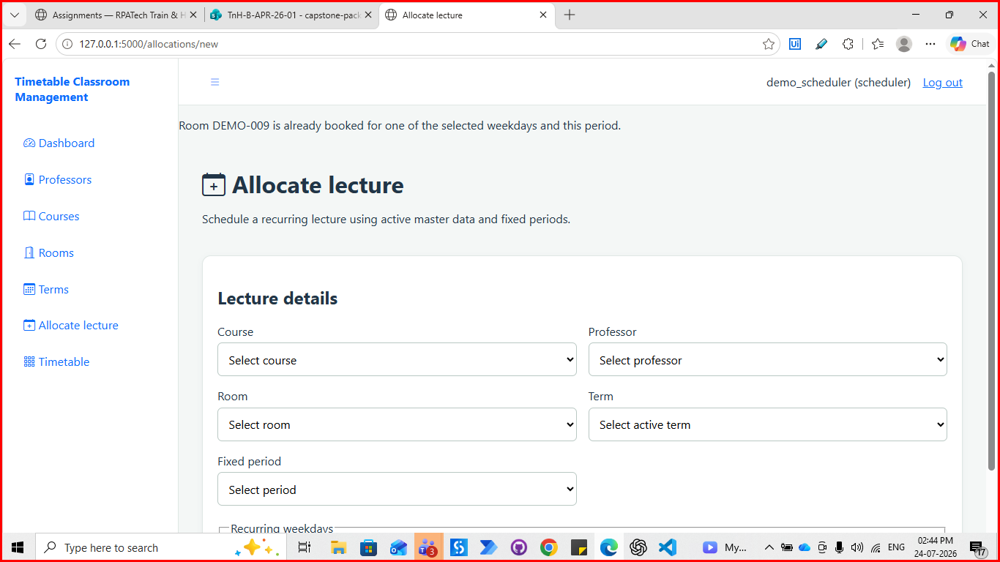
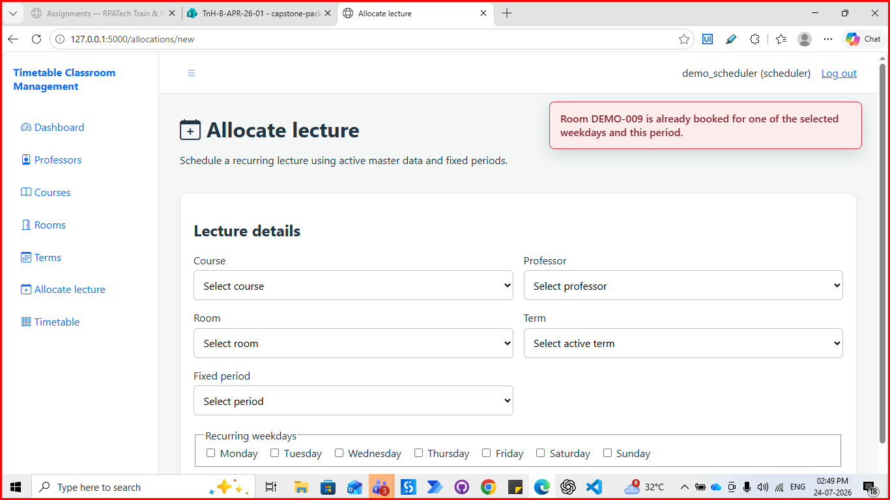
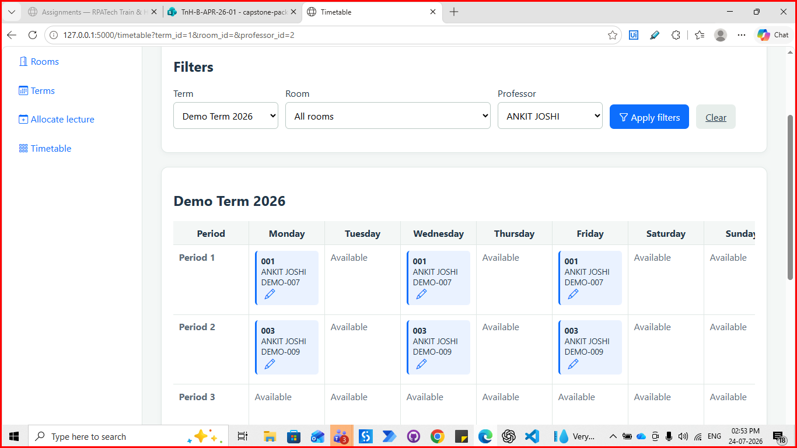
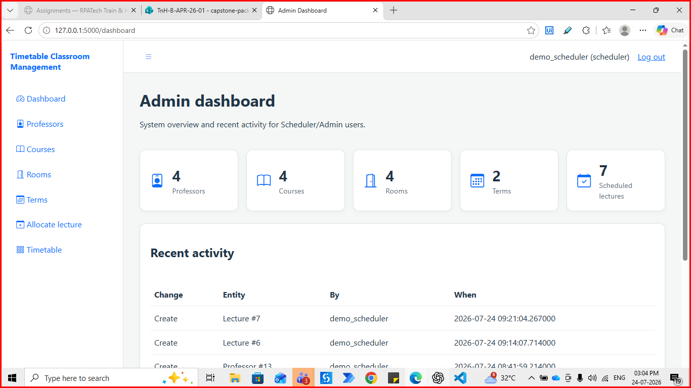
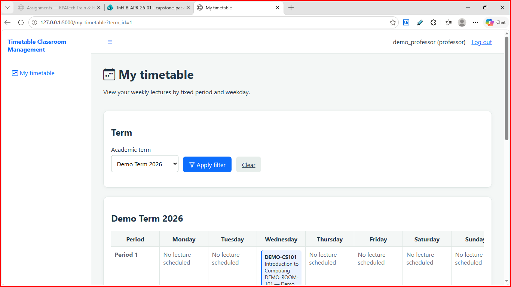

# Timetable Classroom Management

Timetable Classroom Management is a Flask-based academic scheduling system for managing professors, courses, rooms, academic terms, fixed periods, and recurring lecture allocations. It gives Scheduler/Admin users a controlled way to build timetables while giving Professor users a read-only view of their own teaching schedule.

## Project overview

The application is designed around term-scoped scheduling. A lecture belongs to one academic term, uses one fixed period, room, professor, course, and one or more recurring weekdays. The system validates allocations before saving them and prevents active room or professor double-bookings on overlapping recurring instances.

### Main capabilities

- Scheduler/Admin dashboard with summary metrics and recent activity.
- CRUD management for professors, courses, rooms, and academic terms.
- Soft deactivation/restoration of master-data records.
- Recurring lecture allocation using fixed periods and weekdays.
- Conflict protection for rooms and professors, including recurring dates.
- Lecture editing and rescheduling with self-exclusion during validation.
- Term-scoped timetable grid with filters for term, room, and professor.
- Professor-only personal timetable with read-only access.
- Activity logging for important create and update operations.
- Production configuration checks and generic error pages.

## Roles and permissions

| Role | Access |
|---|---|
| Scheduler/Admin | Dashboard, master-data CRUD, lecture creation/editing, timetable filters, activity history |
| Professor | Read-only personal timetable for lectures linked to that professor |
| Unauthenticated visitor | Login page only; protected pages redirect to login |

Only the `scheduler` role can create or edit allocations. Professor users receive HTTP 403 for those operations.

## Scheduling rules

1. Every allocation must use active course, professor, room, term, and period records.
2. At least one recurring weekday is required.
3. A room cannot be assigned to two active lectures in the same term, period, and recurring weekday.
4. A professor cannot teach two active lectures in the same term, period, and recurring weekday.
5. Conflict messages identify the specific room or professor and are shown as red alert boxes.
6. Editing a lecture excludes its own ID, so saving unchanged values does not conflict with itself.
7. The same room or professor can be reused in a different academic term.
8. Deactivation is soft-delete behavior; historical records and audit information are retained.

## User interface

The UI follows the project conventions: persistent sidebar and header, Bootstrap Icons, cards, responsive grids, accessible focus states, DataTables-style lists, modal forms, and consistent notifications.

The 60:30:10 palette is:

- 60% background: `#F4F7F6`
- 30% surface/cards: `#FFFFFF`
- 10% primary accent: `#0D6EFD`

### Screenshots

#### Scheduler/Admin dashboard

Summary cards show counts for professors, courses, rooms, terms, and scheduled lectures, followed by recent activity.



#### Lecture allocation form

Schedulers select the course, professor, room, term, fixed period, and recurring weekdays.



#### Room conflict notification

An invalid room assignment is rejected with a specific red alert identifying the booked room.



#### Professor conflict notification

An invalid professor assignment is rejected with a specific red alert identifying the professor.


#### Scheduler timetable grid

Schedulers can filter a term, room, or professor and review recurring lectures by period and weekday.



#### Activity dashboard

The activity history records who created or changed scheduling entities and when.



#### Professor personal timetable

Professor users see only their own read-only timetable and can filter it by academic term.



## Technology stack

- Python 3
- Flask application factory
- Microsoft SQL Server accessed through `pymssql`
- Server-rendered Jinja templates
- HTML/CSS with Bootstrap Icons and DataTables assets
- `unittest` test suite

## Repository structure

```text
app/                    Flask application, routes, auth, templates, static assets
database/               Schema, seed data, migrations, verification scripts
services/               Database, conflicts, recurrence, activity, and helpers
tests/                  Automated unit and route tests
docs/screenshots/       README screenshots and UI evidence
capstone-pack-*_PRD.md  Product requirements
UI_CONVENTIONS.md       Interface and visual conventions
run.py                  Application entry point
requirements.txt        Python dependencies
```

## Run locally

1. Create and activate a virtual environment.
2. Install dependencies:

   ```bash
   pip install -r requirements.txt
   ```

3. Copy `.env.example` to `.env` and set local database and application values. Never commit `.env` or `env` files.
4. Start the development server:

   ```bash
   flask --app run:app run --debug
   ```

The application factory can also be imported directly:

```python
from app import create_app

app = create_app()
```

## Database and demo data

All application database access goes through `services/db.py`. The schema is maintained in `database/schema.sql`. To create safe local demonstration records, configure local-only seed credentials and run:

```bash
python -m database.seed
```

The seed is idempotent and does not delete existing records or insert intentionally conflicting allocations. After seeding, run the read-only conflict verification command:

```bash
python -m database.verify_conflicts
```

## Testing and production readiness

Run the test suite from the project root:

```bash
python -m unittest discover -s tests -v
```

For production, set `APP_CONFIG=production` and provide a unique `SECRET_KEY` of at least 32 characters. Production mode disables debug output and uses secure, HTTP-only session cookies. The application rejects missing, placeholder, or test-only production secrets.

## Documentation

The product requirements are documented in [`capstone-pack-timetable-management_PRD.md`](capstone-pack-timetable-management_PRD.md), and the visual/accessibility rules are documented in [`UI_CONVENTIONS.md`](UI_CONVENTIONS.md). These documents are the source of truth for future changes.

## Security notes

- Keep database credentials and secret keys outside Git.
- Use separate credentials for development, testing, and production.
- Do not expose password hashes or connection strings in screenshots, logs, or documentation.
- Review activity logs and database permissions before deployment.
